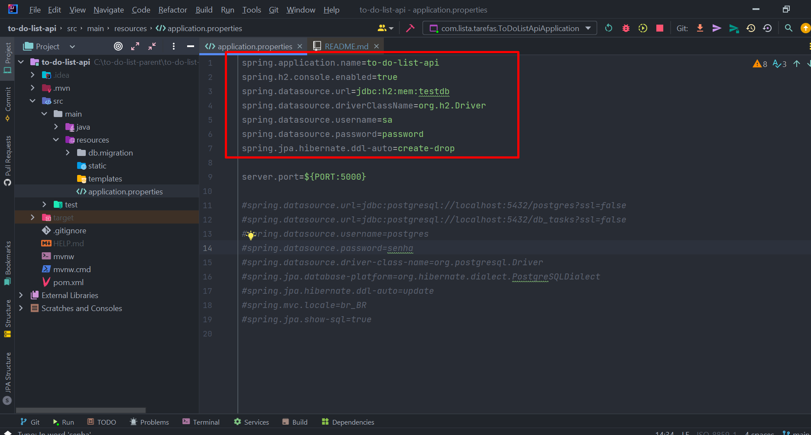
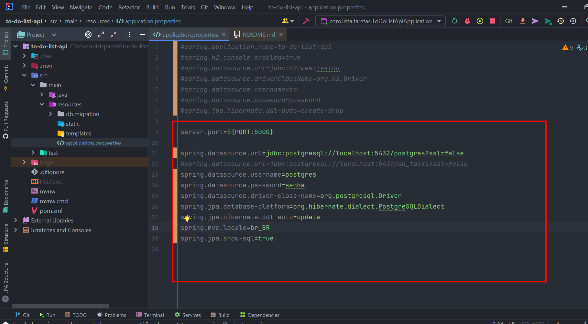
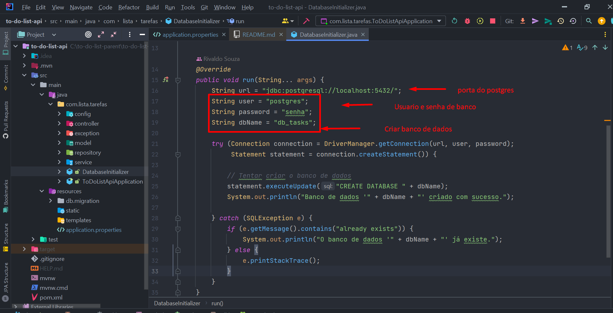
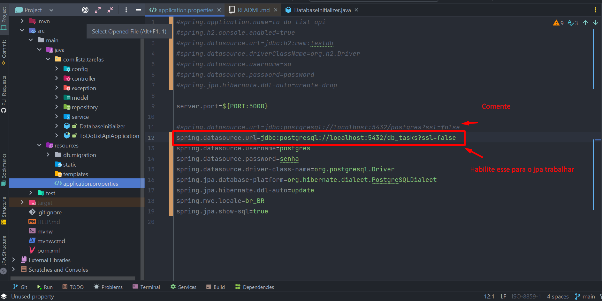
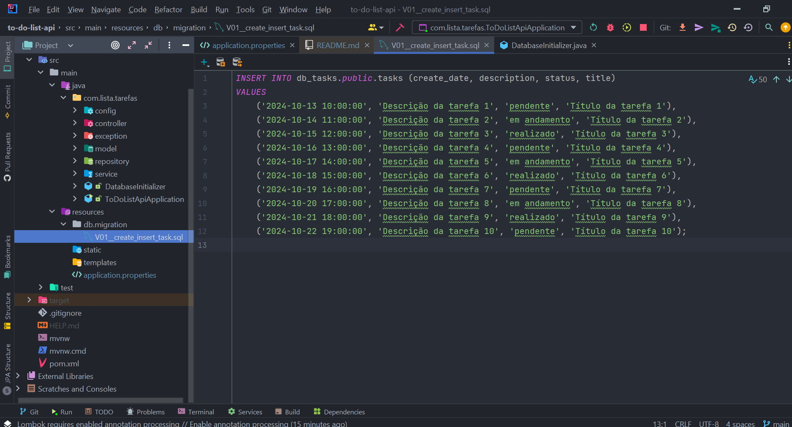

# Documentação do Projeto

## Requisitos de Ambiente

Este projeto requer a instalação do Java (versão 17) e do Node.js (versão 14.18.1) para funcionar corretamente.

### Instalação do Java (Versão 17)

#### Pré-requisitos

- Sistema operacional: Windows, macOS ou Linux
- Acesso à linha de comando

#### Passo a Passo

1. **Baixar o Java JDK 17**
    - Acesse o site oficial do [Oracle JDK](https://www.oracle.com/java/technologies/javase-jdk17-downloads.html) ou do [OpenJDK](https://openjdk.java.net/install/).

2. **Instalação**
    - **Windows:**
        - Execute o instalador e siga as instruções na tela.
        - Adicione o JDK ao seu PATH:
            1. Clique com o botão direito em "Este PC" e selecione "Propriedades".
            2. Clique em "Configurações avançadas do sistema".
            3. Na aba "Avançado", clique em "Variáveis de ambiente".
            4. Na seção "Variáveis do sistema", encontre a variável `Path` e clique em "Editar".
            5. Adicione o caminho para o diretório `bin` do JDK (por exemplo, `C:\Program Files\Java\jdk-17\bin`).

    - **macOS:**
        - Abra o terminal e execute:
          ```bash
          brew install openjdk@17
          ```
        - Adicione o JDK ao seu PATH:
          ```bash
          echo 'export PATH="/usr/local/opt/openjdk@17/bin:$PATH"' >> ~/.bash_profile
          source ~/.bash_profile
          ```

    - **Linux:**
        - Use o gerenciador de pacotes da sua distribuição. Por exemplo, no Ubuntu:
          ```bash
          sudo apt update
          sudo apt install openjdk-17-jdk
          ```

3. **Verificar Instalação**
    - Abra um terminal e execute:
      ```bash
      java -version
      ```
    - Você deve ver a versão do Java 17 instalada.

---

### Instalação do Node.js (Versão 14.18.1)

#### Pré-requisitos

- Sistema operacional: Windows, macOS ou Linux
- Acesso à linha de comando

#### Passo a Passo

1. **Baixar o Node.js**
    - Acesse o site oficial do [Node.js](https://nodejs.org/en/download/releases/) e localize a versão 14.18.1.

2. **Instalação**
    - **Windows:**
        - Execute o instalador e siga as instruções.
        - O instalador deve adicionar o Node.js ao seu PATH automaticamente.

    - **macOS:**
        - Abra o terminal e execute:
          ```bash
          curl -o node-v14.18.1.pkg https://nodejs.org/dist/v14.18.1/node-v14.18.1.pkg
          sudo installer -pkg node-v14.18.1.pkg -target /
          ```

    - **Linux:**
        - Use o gerenciador de pacotes da sua distribuição. Por exemplo, no Ubuntu:
          ```bash
          curl -fsSL https://deb.nodesource.com/setup_14.x | sudo -E bash -
          sudo apt-get install -y nodejs
          ```

3. **Verificar Instalação**
    - Abra um terminal e execute:
      ```bash
      node -v
      ```
    - Você deve ver a versão 14.18.1 do Node.js instalada.

---

### Conclusão

Após instalar o Java e o Node.js, você estará pronto para usar o Angular no seu projeto. Se precisar de mais informações,
consulte a documentação oficial do [Angular](https://angular.io/docs).

###CONFIGURAÇÕES DO PROJETO

Depois das configurações de ambiente, tem a configuração do projeto que por padrão está em h2, salva em memória
para teste segue imagem abaixo:
 
1. Configuração padrão


2. Nesta parte está a configuração de banco de dados para postgres


3. Segue as configurações de banco de seu usuario e senha do postgres e nome banco que deve ser criado.


4. Nesse próximo somente troque o spring.datasource.url para o jpa criar a tabela.


5. Foi criado um package migração para inserir dados no postgres para testes.


6. Agora no angular no projeto na versão do node 14.18.1, npm install para depedencia e subir o app.